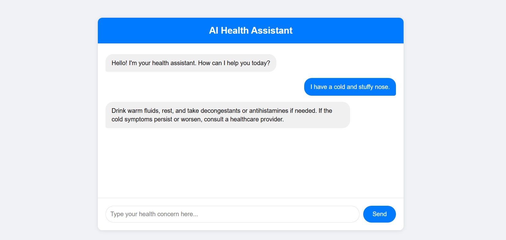

# AI Health Assistant ChatBot

This project is a web-based application that uses **FastAPI** and Hugging Face's pre-trained **GPT-2 model** to provide health solutions based on user-reported symptoms. The user inputs a health problem, and the AI generates relevant health advice or tips based on that input.

## Features

- **FastAPI Backend**: Serves as the backend for the application, handling user input and providing responses.
- **Hugging Face's GPT-2 Model**: Generates health-related solutions based on user-reported symptoms.
- **Simple UI**: The frontend allows users to input their symptoms and receive AI-generated advice.
- **No database**: Uses the GPT-2 model to generate responses on the fly without relying on any database.

## Why upload zip?
We face with commit with venv file upload. That's why we remove this file and compress zip and upload it.

## Installation Process
- Download repository zip
- Unzip it
- create virtual environment
- install requirements.txt file
- run fasapi app

## Output sample of this project

